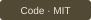
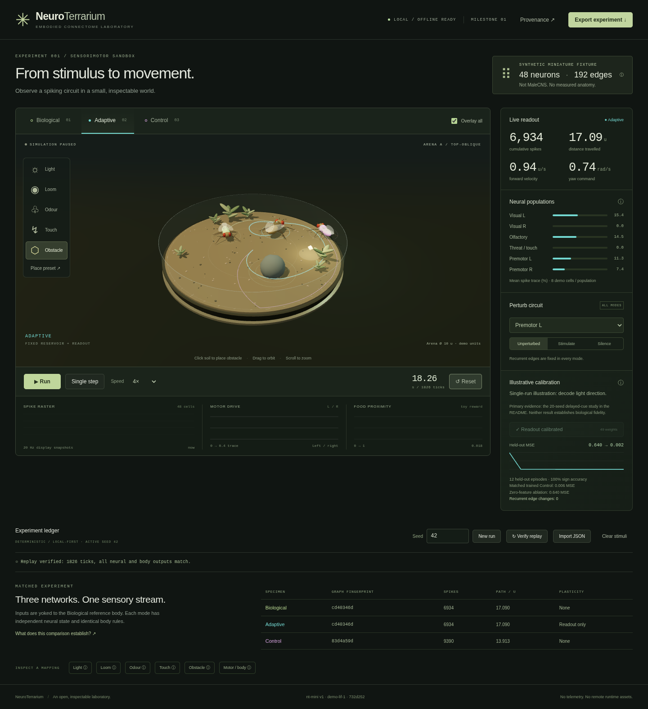

# NeuroTerrarium

[](https://github.com/5p00kyy/neuroterrarium/actions/workflows/ci.yml) [](https://github.com/5p00kyy/neuroterrarium) [](LICENSE)

The CI badge links the workflow, not an asserted passing hosted run. Hosted CI remains a review/merge gate.

**An open, inspectable laboratory for embodied connectome intelligence.**

Milestone 1 connects stimulus → spiking network → motor output → procedural fly movement in a local 3D terrarium. It is a scientific-instrument vertical slice, not a biological fidelity result.

> **Two separate instruments.** The default 48-neuron terrarium is synthetic, not MaleCNS. The dataset selector also opens a real **51-body giant-fiber input microcircuit**, with **1,240 measured directed pairs and 28,373 contacts**. Its topology executes only after validation; signs are inferred and dynamics/current mappings remain demo-only. It never drives the fly body. Small CC-BY source responses, exact queries and checksums are bundled. [Phase 3 authority, contracts and limitations](docs/PHASE3.md).

## Phase 3: inspect real wiring, without inventing behavior

Select **MaleCNS v1.0 · GF input microcircuit**. Explore brain/VNC region membership, ranked cell-type routes and individual body IDs. Run a bounded pulse experiment against five matched controls and five ablations, inspect provenance, then export and verify replay. No full CNS or measured morphology is rendered.

**Negative result:** Biological and all five rewired controls produce the same response to the default pulse. No topology advantage or behavioral fidelity is established. Six glutamatergic bodies and 417,398 outgoing boundary contacts are explicitly omitted. [Scientific result](docs/PHASE3.md) · [verification evidence](docs/PHASE3_VERIFICATION.md).



The macro capture shows the original fly-inspired avatar in the synthetic laboratory, not imported anatomy. The 48-neuron fixture is scaffolding, not the full-scale product. Direct visual acceptance remains pending; automated browser checks do not establish art-direction quality.

The visual pass adds articulated legs, faceted eyes, veined wings, model-labelled stimulus fields, a macro camera, guided onboarding and spike-linked signed circuit projection. Compact layouts use population tiles instead of a shrunken network diagram. [Full-scale architecture and visual truth boundaries](docs/FULL_SCALE_DESIGN.md) describe the offline compiler, aggregated-edge runtime, bounded activity stream and future multiscale/morphology views.

## Primary Phase 2 evidence

A delayed-cue cross-context benchmark evaluates 20 independently shuffled matched graphs with disjoint train/validation/test streams, readout-only fitting, and four conditions:

| Condition         | Fixture test MSE, mean ± SD | Matched Control test MSE, mean ± SD |
| ----------------- | --------------------------- | ----------------------------------- |
| Full graph        | 0.382233 ± 0.019242         | 0.383745 ± 0.020251                 |
| No recurrence     | 0.371280 ± 0.019540         | 0.371280 ± 0.019540                 |
| Visual-L ablation | 0.563159 ± 0.045112         | 0.559340 ± 0.049624                 |
| Zero features     | 0.640000 ± 0                | 0.640000 ± 0                        |

**The full fixture and shuffled graphs are nearly tied, and removing recurrence is slightly better here.** This validates a reproducible method, not a biological topology advantage or a closed-loop navigation learner. The in-app calibration is only an illustration. [Protocol, per-seed export and interpretation](docs/BENCHMARK.md).

- **Verified official import:** 159 bodies, 128 pairs, 105,268 raw synapses, from 3.69 MB of anonymous official range reads. Counts, transmitter fields and checksums independently verified offline. Not a complete circuit and not loaded into the app. [Ingestion evidence](docs/INGESTION.md).
- **Measured synthetic scale:** 166,700 neurons / 5,334,400 edges, 56.31 instrumented CPU ticks/s in the clean final run on the measured Xeon host. Not MaleCNS and not a browser/end-to-end benchmark. [Profile method and limits](docs/PERFORMANCE.md).
- **CI:** pinned read-only GitHub Actions workflow, local or managed Chromium, bounded scientific tests and retained evidence. No deployment. [Contributing](CONTRIBUTING.md).

## Run locally

Requires Node 22.12+ (tested on 22.23.1), npm, and a modern WebGL2 browser. Installation needs npm registry access; the running app uses no remote assets, API, account, telemetry or credentials.

```sh
npm ci --cache .cache/npm --no-audit --no-fund
npm run dev
# Open http://127.0.0.1:5173
```

For the production version:

```sh
npm run build
npm run preview
# Open http://127.0.0.1:4173
```

Both servers bind to loopback. Stop with Ctrl+C. No persistent infrastructure is installed. The loaded app continues simulating with networking disabled; a cold load still needs the local static server. This is not a service-worker/PWA installation. Reloading closes the in-memory run, so export before leaving.

## A two-minute experiment

1. Use **Start with light** for the guided entry, or keep **Biological** selected. This means fixed **demo** topology, not measured anatomy. The empty arena is silent and still.
2. Select **Light**, then click the soil or use **Place preset** (keyboard-accessible, +2/+1 arena units). Press **Run**. Watch neural populations, motor traces, path and cumulative spikes. Choose **Inspect fly** for macro framing; drag to orbit or scroll to examine the procedural fly.
3. Try **Odour**, **Loom**, **Touch** or **Obstacle**. One source per tool is retained; placement replaces that source. Touch lasts 20 ticks, looming lasts 100. Clear stimuli without resetting to observe decay.
4. Silence or stimulate a named demo population. Perturbations apply equally to all specimens and never edit recurrent edges.
5. Switch to **Control**, or enable **Overlay all**. Three independent networks are always simulated with identical sensory input yoked to the Biological reference body.
6. **Train readout**. Adaptive changes only 48 neural readout weights plus a bias. The 24-episode calibration, 12-episode held-out result, trained-control score and zero-feature ablation are visible. It is supervised light-side decoding, not learned navigation.
7. Open **Provenance**, or any sensor/motor inspector, to separate published context from invented choices.
8. **Export experiment**, then **Verify replay**. Reset and **Import JSON** to verify and restore that exact run. A tampered output is rejected without replacing the current experiment.

Pause, 10 ms single-step, 0.25×/1×/2×/4× pacing, integer seeds and reset are available. Recording is capped at 300 simulated seconds and 2,000 events to keep this fixture-scale implementation bounded.

## What each terrarium mode means

| Mode       | Recurrent graph                                 | Trainable parameters             | Body                                            |
| ---------- | ----------------------------------------------- | -------------------------------- | ----------------------------------------------- |
| Biological | Fixed synthetic fixture                         | None                             | Identical kinematics                            |
| Adaptive   | The same fixed fixture                          | 49 explicit readout coefficients | Identical kinematics, learned yaw readout added |
| Control    | Reproducible degree/sign/weight-matched shuffle | None in the embodied specimen    | Identical kinematics                            |

Control training is a separate diagnostic using the same calibration protocol. It does not alter the Control specimen. Both topologies can solve this tiny task. Scores do not establish a connectome advantage. See [scientific contracts and limitations](docs/SCIENCE.md).

## Architecture

- **src/sim/network.ts:** typed-array LIF backend, synthetic CSR graph and matched shuffle. No React or Three dependency.
- **src/sim/experiment.ts:** deterministic tick semantics, shared sensory drive, independent bodies, event log, manifests and replay.
- **src/sim/learning.ts:** regularized readout-only calibration with disjoint train/test episode streams.
- **src/sim/worker.ts + protocol.ts:** typed worker messages, wall-clock pacing, recording limits and verified import/export. Rendering cannot advance neural state.
- **src/Scene.tsx:** original procedural fly, soil, glass rim, plant geometry, tools and paths in React Three Fiber. No remote textures or fonts.
- **src/App.tsx:** DOM instrument controls, live signals, comparative ledger and provenance inspector.
- **src/sim/adapter.ts:** validated small-table conversion interface for a future real-data importer. Not a production-scale importer or an enabled dataset upload path.

CSR provides a credible backend boundary, not proof of full-scale performance. Full-spike recording, clone-based worker snapshots, the Map-based converter and Set-based shuffle are intentionally fixture-scale. [The verified ingestion boundary and next scientific gate](docs/INGESTION.md) separates the verified synthetic scale profile from the still-unverified full real-data simulation.

## Verification

```sh
npm run typecheck
npm test
npm run format:check
npm run benchmark
npm run circuit:verify
npm run circuit:smoke
npm run profile
npm run build
npm run test:browser
```

Browser tests use an existing Chromium at /usr/bin/chromium locally, or Playwright-managed Chromium in CI. Override with CHROMIUM_PATH pointing to your installed Chromium. No browser or dataset download runs automatically. Test launch is headless software WebGL and uses a project-local temporary directory. The test runner starts and stops its own loopback production preview.

The critical test places a stimulus through a real 3D raycast, checks movement, pause and single-step, exercises all tools, perturbation, calibration and mode comparison, inspects provenance, exports/imports an experiment, verifies every tick and rejects tampering. Networking is disabled after the initial load. A compact 390 px viewport test checks keyboard placement and overflow.

Review artifacts are intentionally ignored under **artifacts/**:

- desktop-initial.png and desktop-verified.png: desktop captures
- provenance.png and mobile.png: inspector and compact layout
- deterministic-run.json: full recorded run, code provenance and readout diff
- browser-console.json: console errors, warnings, external-request log and calibration evidence
- browser-results.json and browser-runs/: machine-readable test result and failure traces

The code commit and dirty-state marker are embedded at build time. Build from a clean commit for release-quality provenance. Raw browser-run artifacts are ignored; one optimized screenshot is committed under docs/assets for review. See [docs/VISUAL_PASS.md](docs/VISUAL_PASS.md) for the latest visual pass and remaining review gate, docs/PHASE2_VERIFICATION.md for the scientific checkpoint, and docs/VERIFICATION.md for historical Milestone 1 review.

## Attribution and licence

Original code and procedural geometry: [MIT](LICENSE). Scientific citations and dependency attribution: [docs/ATTRIBUTION.md](docs/ATTRIBUTION.md). Future MaleCNS ingestion must preserve CC-BY 4.0 attribution and verify the release and source checksums. No code was copied from the scientific reference repositories.

The source repository is public. This phase does not deploy, publish a package, create a release, download the full connectome, add WebGPU or claim biomechanical integration.
